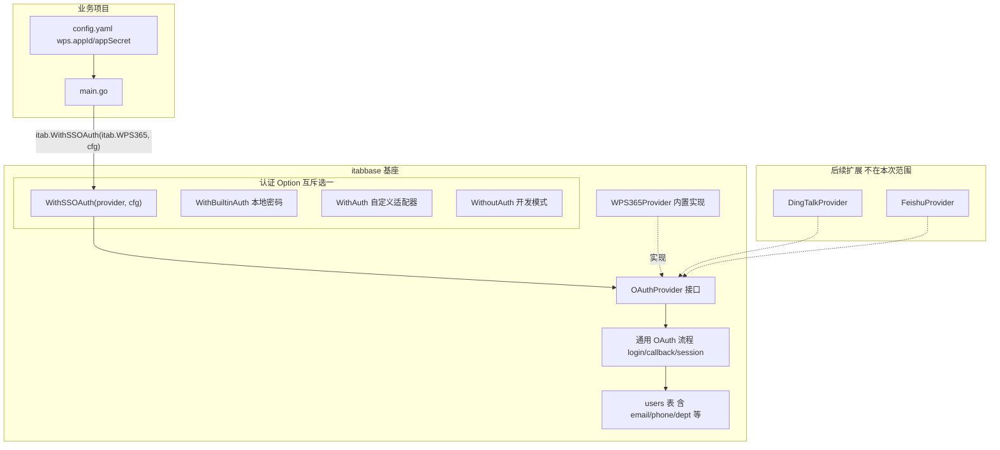
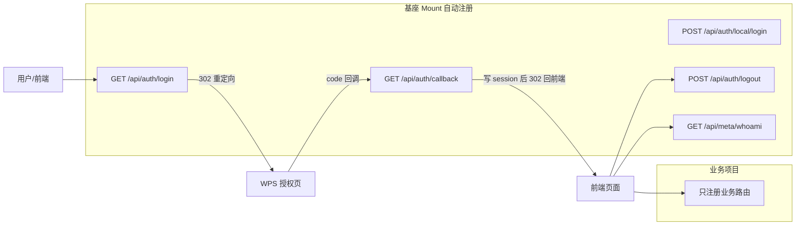

# SSO 认证下沉基座 -- 通用 OAuthProvider 架构

## 设计目标

基座提供通用 SSO 能力，内置 WPS365 实现；业务项目只需选 Provider + 填配置。后续扩展钉钉/飞书只需新增 Provider 实现，不改基座核心流程。

## 整体架构




## 核心接口定义

在 [server/auth.go](server/auth.go) 中新增：

```go
// OAuthProvider 是 SSO 提供商的通用抽象。
// 基座内置 WPS365Provider；后续可扩展钉钉/飞书等。
// 业务也可自行实现此接口接入任意 OAuth2 提供商。
type OAuthProvider interface {
    Name() string
    AuthorizeURL(state, redirectURI string) string
    ExchangeToken(ctx context.Context, code string) (OAuthToken, error)
    FetchUser(ctx context.Context, token OAuthToken) (OAuthUserInfo, error)
}

type OAuthToken struct {
    AccessToken  string
    RefreshToken string
    ExpiresIn    int
    OpenID       string
}

type OAuthUserInfo struct {
    ExternalID     string            // 提供商侧用户唯一 ID
    OpenID         string            // 应用级 ID
    UnionID        string            // 跨应用 ID
    Name           string
    Avatar         string
    Email          string
    Phone          string
    Gender         string
    EmployeeID     string            // 工号
    Title          string            // 职务
    Department     string            // 部门名称
    DepartmentPath string            // 部门完整路径
    CompanyID      string            // 企业 ID
    Extra          map[string]string // 提供商特有字段
}
```

## 业务使用方式

业务项目 `config.yaml`（WPS 配置在业务侧，不在基座）：

```yaml
wps365:
  appId: "${WPS_APP_ID}"
  appSecret: "${WPS_APP_SECRET}"
  redirectUri: "https://my-app.example.com/api/auth/callback"
  baseURL: "https://openapi.wps.cn"
```

业务项目 `main.go`：

```go
k := itab.New(
    itab.WithDB(g.DB()),
    itab.WithSSOAuth(itab.WPS365, itab.SSOConfig{
        AppID:       g.Cfg().MustGet(ctx, "wps.appId").String(),
        AppSecret:   g.Cfg().MustGet(ctx, "wps.appSecret").String(),
        RedirectURI: g.Cfg().MustGet(ctx, "wps.redirectUri").String(),
        BaseURL:     g.Cfg().MustGet(ctx, "wps.baseURL").String(),
    }),
)
```

不需要 SSO 的业务照旧用其他 Option：

```go
k := itab.New(itab.WithDB(g.DB()), itab.WithBuiltinAuth())  // 本地密码
k := itab.New(itab.WithDB(g.DB()), itab.WithAuth(myAdapter)) // 自定义
k := itab.New(itab.WithDB(g.DB()), itab.WithoutAuth())       // 开发
```

## 实施步骤

### 步骤 1：定义 OAuthProvider 接口

在 [server/auth.go](server/auth.go) 中新增 `OAuthProvider`、`OAuthToken`、`OAuthUserInfo`、`SSOConfig` 类型。

### 步骤 2：扩充 users 表

在 [server/builtin.go](server/builtin.go) 的 `builtinUsersCollection()` 中补充字段：

- `email` (string, 200)
- `phone` (string, 32)
- `gender` (string, 16)
- `employee_id` (string, 64)
- `title` (string, 128)
- `department` (string, 256)
- `department_path` (string, 500)
- `company_id` (string, 128)
- `openid` (string, 128)
- `unionid` (string, 128)

基座的 schema sync 会自动执行 `ALTER TABLE ADD COLUMN`，无需手动迁移。

### 步骤 3：实现 WPS365Provider

新建 [server/auth_wps365.go](server/auth_wps365.go)，从 `it-ai-base/server/internal/pkg/wps365auth` 提取核心逻辑：

- `WPS365` 变量（Provider 单例）
- `AuthorizeURL` -- 拼接 WPS OAuth2 authorize 地址
- `ExchangeToken` -- POST code 换 access_token
- `FetchUser` -- GET `/graph/v7/users/current` 或 `/oauthapi/v5/userinfo` 获取用户信息

### 步骤 4：实现 WithSSOAuth + SSO 路由

新建 [server/auth_sso.go](server/auth_sso.go)：

- `WithSSOAuth(provider OAuthProvider, cfg SSOConfig) Option`
- `GET /auth/login` -- 生成 state、redirect 到 provider.AuthorizeURL
- `GET /auth/callback` -- 验证 state、ExchangeToken、FetchUser、upsert users 表、写 session
- `POST /auth/logout` -- 清 session
- 内部实现 `AuthAdapter` 接口（从 session 读 user_id，查 users 表）

### 步骤 5：扩充 whoami

修改 [server/meta.go](server/meta.go) 的 `handleWhoami`，返回完整用户信息（email/avatar/department 等），从 DB 读取。

### 步骤 6：admin 前端适配

- [admin/src/views/login/index.vue](admin/src/views/login/index.vue) -- WPS 登录按钮已有，确认 `loginURL()` 指向 `/api/auth/login`
- [admin/src/api.ts](admin/src/api.ts) -- User 类型补充 email/avatar/department 等字段
- [admin/src/stores/user.ts](admin/src/stores/user.ts) -- whoami 数据映射

### 步骤 7：it-ai-base 迁移（后续单独做）

删除 `server/internal/pkg/wps365auth`、`service/auth`、`kernelglue` 等，改用 `itab.WithSSOAuth(itab.WPS365, cfg)`。

## 文件变更清单


| 文件                         | 操作  | 说明                                        |
| -------------------------- | --- | ----------------------------------------- |
| `server/auth.go`           | 修改  | 新增 OAuthProvider 接口 + 相关类型                |
| `server/auth_sso.go`       | 新建  | WithSSOAuth Option + 路由 + session 管理      |
| `server/auth_wps365.go`    | 新建  | WPS365Provider 实现                         |
| `server/builtin.go`        | 修改  | users 表新增字段                               |
| `server/meta.go`           | 修改  | whoami 返回完整信息                             |
| `server/kernel.go`         | 修改  | Kernel struct 新增 ssoProvider/ssoConfig 字段 |
| `admin/src/api.ts`         | 修改  | User 类型补字段                                |
| `admin/src/stores/user.ts` | 修改  | whoami 数据适配                               |


## SSO 接口总览

基座 `Mount()` 在 `WithSSOAuth` 模式下自动注册以下路由，业务项目无需手动挂载：



- `GET /api/auth/login?return=<url>` -- 生成 state 并 302 跳转到 WPS 授权页，return 参数指定授权成功后回跳地址
- `GET /api/auth/callback?code=<code>&state=<state>` -- WPS 回调端点，验证 state、用 code 换 token、拉取用户信息、upsert users 表、写 session，最后 302 回 return 地址
- `POST /api/auth/local/login` -- 本地账号密码登录（可与 SSO 并存，支持 admin 后台密码登录）
- `POST /api/auth/logout` -- 清除当前 session
- `GET /api/meta/whoami` -- 返回当前登录用户完整信息（id/name/email/avatar/roles/department 等）

## 不在本次范围

- DingTalk/Feishu Provider（接口已预留，后续按需实现）
- 企业通讯录同步（需 `kso.contact.read` 权限，属增强功能）
- Token refresh 定时任务（MVP 可在 callback 时一次性拉取）

